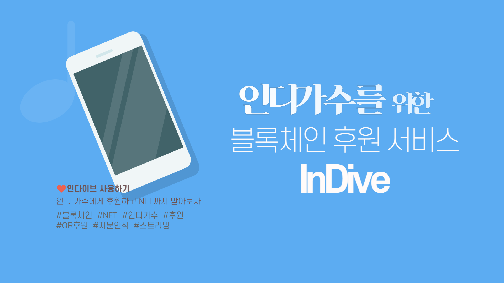
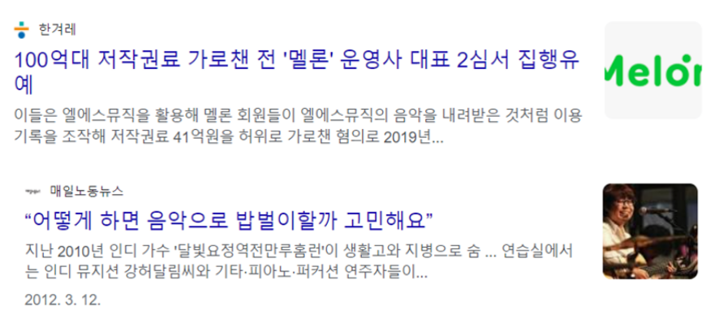
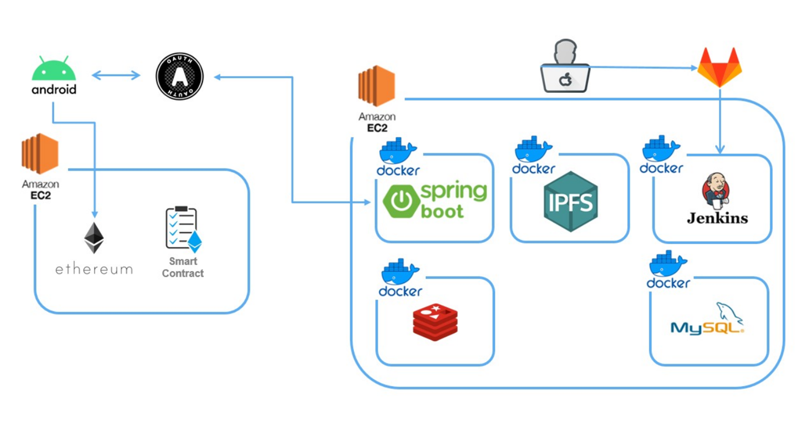
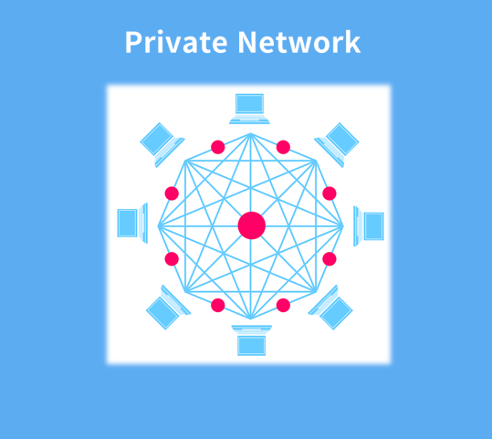
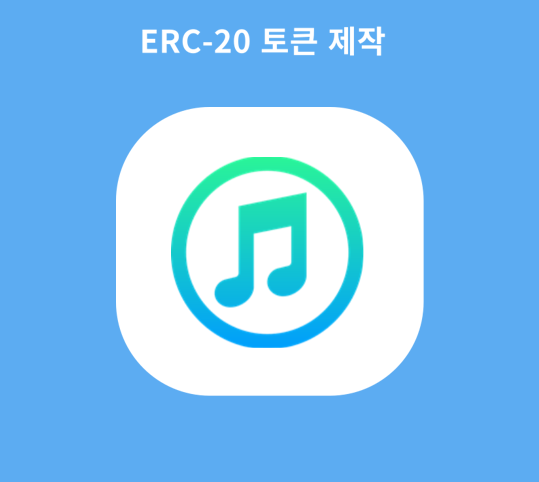
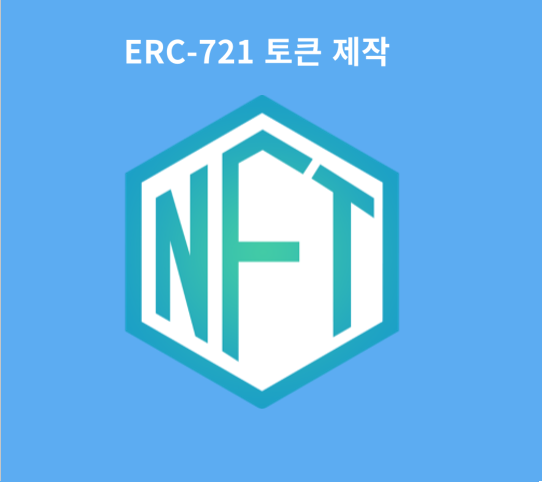
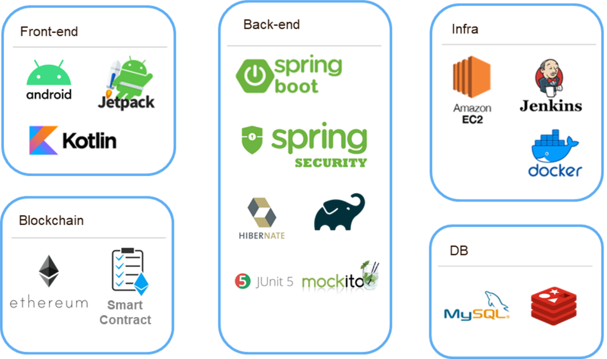
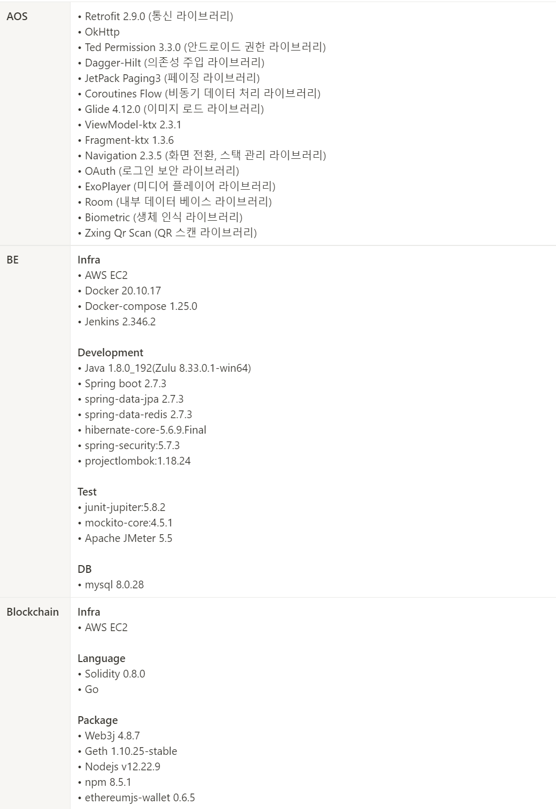

# 🎼 INDIVE

    

인디 뮤지션을 위한 블록체인 후원 서비스, `InDive`입니다.

인디 음악을 뜻하는 `Indi`와 빠지다의 `Dive`라는 단어를 합쳐 인디 음악에 빠지다라는 의미를 담았습니다!

 

## 🎇 기획 배경

    

보통 뮤지션들의 수입은 보통 공연이나 음악 저작물을 통해 발생합니다. 하지만 인지도가 낮을 경우 그 수입이 굉장히 적겠죠. 

심지어 2019년 6월에는 멜론의 횡령 사건으로 인해 인디 뮤지션들의 생활고로 인한 피해는 더욱 심화되었습니다. 

따라서, 저희는 이러한 인디 뮤지션들의 고충을 해결하고자 다음과 같이 기획을 구체화하게 되었습니다.

1. 인디 뮤직 시장을 활성화하여 대중들에게 인디 뮤지션들을 쉽게 접할 수 있게 만들어줍니다.
2. 후원 시스템을 통해 인디 뮤지션을 지원함으로써 인디 뮤지션들의 생활고를 덜어줄 수 있습니다.
3. 블록체인 기술을 활용해서 후원 금액을 횡령하거나 또 사기를 칠 수 있는 여지를 주지 않습니다.

 

## 🖥️ 서버 아키텍처

    

저희 서비스의 아키텍처입니다. 깃랩에서 `Push Event`가 발생하면 Webhook에 의해 젠킨스로 소스 파일이 전송됩니다. 해당 소스 파일을 이용해 `[build - test - deploy]`로 이루어지는 CI/CD 환경을 구축하였습니다.

테스트에는 JUnit5와 커버리지 측정을 위한 Jacoco 라이브러리를 사용하였고, 배포는 도커를 활용하였습니다.

 

## 🌍 블록체인 기술 차별점

1. 블록체인 사설 네트워크

    

        
    

    이더리움 사설 네트워크를 구축하였습니다. 사설 네트워크 상에서 저희 서비스만 이용하기 떄문에 블록 수도 상대적으로 적어 로딩 시간을 단축할 수 있었습니다.

2. ERC-20 토큰 제작

    

        
    

    ERC-20 스펙을 구현한 자체 토큰을 제작하여 저희 후원 서비스에 이용하고 있습니다. 토큰의 단위는 IVE이고 1 IVE는 1000원의 가치를 가지고 있습니다.

3. ERC-721 NFT 제작

    

        
    

    후원자들에게 아티스트가 후원에 대한 보상을 줄 수 있도록 ERC-721 스펙을 구현한 NFT 토큰을 제작했습니다.

 

## 📱 기술 스택

    

블록체인 기술 이외에도 서비스에 다양한 기술 스택들을 사용했습니다!

    

 

## 🌈 서비스 기능

저희 서비스의 기능은 크게 회원 관리 서비스, 음원 스트리밍 서비스, 후원 서비스, 보안 및 편의 기능으로 나뉩니다. 

❤️ 회원 서비스

- [회원가입](./assets/md/회원가입.md)

- [로그인](./assets/md/로그인.md)

- [프로필 수정](./assets/md/프로필_수정.md)

🧡 음원 스트리밍 서비스

- [곡 등록](./assets/md/곡_등록.md)

- [음원 재생](./assets/md/홈에서_노래_재생.md)

- [음원 검색](./assets/md/검색.md)

- [음원 리스트 조회](./assets/md/노래_리스트_보여주기.md)

- [음원 상세정보 조회](./assets/md/노래_상세정보.md)

- [댓글](./assets/md/댓글_달기.md)

- [장르별 조회](./assets/md/장르_카테고리.md)

- [노티피케이션](./assets/md/노티피케이션.md)

💛 후원 서비스

- [블록체인 지갑](./assets/md/지갑_트랜잭션_보여주기.md)

- [후원](./assets/md/후원하기.md)

- [NFT 등록](./assets/md/nft_등록.md)

- [NFT 보관함](./assets/md/nft_보관함.md)

💚 보안 및 편의 기능

- [지문 인증](./assets/md/지문인증.md)

- [QR 기부](./assets/md/qr_기부화면.md)

- [알림](./assets/md/노티피케이션.md)

- [하단 재생바](./assets/md/홈에서_하단_재생바_보여주기.md)

 

## 🔖 프로젝트 빌드 방법

빌드 매뉴얼은 길어질 것 같아 따로 페이지를 만들어 두었습니다!

    
        
    
    &nbsp
    
        
    
    &nbsp
    
        
    

 

## 📝 노션 페이지

저희 프로젝트의 문서와 저희 팀원들이 어떤 방법론에 맞춰 작업했는지 알고 싶으시다면 저희 프로젝트 노션 페이지를 방문해주세요!

    

