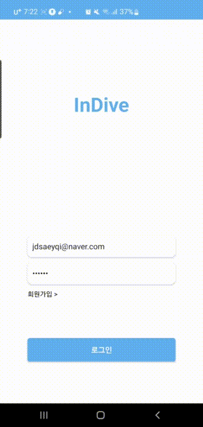

# 로그인

    
        
    
    &nbsp&nbsp&nbsp
    
        
    
    <h6>정상 로그인(좌) / 개인키가 없는 경우(우)</h6>

저희 서비스는 자체 로그인을 제공합니다.
JWT 토큰 기반 인증 시스템으로 로그인 정보를 관리하기 때문에 안전한 로그인이 가능합니다.
앱 재설치 후 로그인 시 지갑 복구를 위해 개인키 입력을 요구할 수 있습니다.
