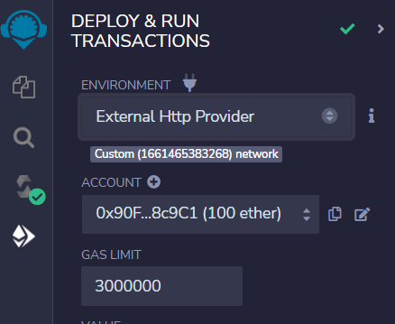
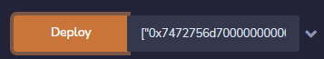
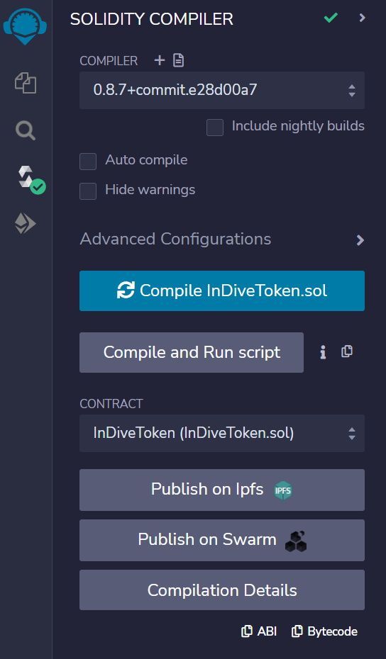

# 포팅 매뉴얼

# 블록체인 네트워크

## 1. 프라이빗 블록체인 네트워크 구성

### 1.1 패키지 설치

리눅스 환경에서 이더리움 네트워크를 만들기 위해 필요한 패키지를 설치해줍니다.

```bash
$ sudo apt-get install software-properties-common
$ sudo add-apt-repository -y ppa:ethereum/ethereum
$ sudo apt-get update
$ sudo apt-get install ethereum
```

2022-09-14 기준 **1.10.23-stable** 버전을 사용했습니다.

```bash
$ geth version

Geth
Version: 1.10.23-stable
Git Commit: d901d85377c2c2f05f09f423c7d739c0feecd90a
Architecture: amd64
Go Version: go1.18.5
Operating System: linux
GOPATH=
GOROOT=go
```

### 1.2 첫 번째 블록 생성

연결된 블록을 형성하기 위해 첫 번째 블록이 필요합니다. Genesis Block 이라고 하며 블록체인 네트워크에 대한 설정을 해줄 수 있습니다.

제네시스 블록은 아래와 같은 세팅을 사용했습니다. 괄호 안의 값은 일단 바꾸지 않고 다음으로 진행합니다.

- Genesis.json

```json
{
  "config": {
    "chainId": 102,
    "homesteadBlock": 0,
    "eip150Block": 0,
    "eip155Block": 0,
    "eip158Block": 0,
    "byzantiumBlock": 0,
    "constantinopleBlock": 0,
    "petersburgBlock": 0,
    "istanbulBlock": 0,
    "berlinBlock": 0,
    "contractSizeLimit": 2147483647,
    "clique": {
      "period": 1,
      "epoch": 30000
    }
  },
  "difficulty": "0x400",
  "nonce": "0x0000000000000042",
  "gasLimit": "0x1fffffffffffff",
  "extradata": "0x0000000000000000000000000000000000000000000000000000000000000000${0x를 제외한 주소}0000000000000000000000000000000000000000000000000000000000000000000000000000000000000000000000000000000000000000000000000000000000",
  "coinbase": "${주소}",
  "mixhash": "0x0000000000000000000000000000000000000000000000000000000000000000",
  "parentHash": "0x0000000000000000000000000000000000000000000000000000000000000000",
  "timestamp": "0x00",
  "alloc": {
    "${주소}": { "balance": "1000000000000000000000000" }
  }
}
```

- **config** : geth 1.6 이전 버전 접속 시 발생할 수 있는 문제점을 해결하는 옵션. 사설 네트워크 일 결우 위 값으로 설정
  - chainId : 현재 chain을 식별하는 값. replay attack을 막기 위해 사용
  - homesteadBlock : Homestead는 두 번째 Ethereum release 버전 0으로 set하면 Homestead 버전을 사용하는 것을 의미
  - eip150Block : Ethereum Improvement Proposal; 이더리움 플랫폼 표준 문서
- **mixhash** : nonce와 함께 블록의 작업증명을 위한 옵션
- **parentHash** : nonce와 mixhash를 포함한 부모 블록의 헤더에 대한 해시 값을 갖는 옵션. Genesis 블록은 최초의 블록이기 때문에 값은 0입니다.
- **difficulty** : 블록 생성을 위한 계산 난이도 설정. 값에 따라 채굴 속도가 달라짐
- **gasLimit** : 하나의 블록이 담을 수 있는 gas의 임계치. 값을 높일 수록 block 하나에 포함할 수 있는 gasLimit이 늘어남
- **coinbase** : 해당 블록에 대해 채굴에 성공하면 얻게되는 총 보상금을 160비트 주소값으로 표현. 채굴 보상금과 스마트 컨트랙트 실행의 환불 값의 합을 나타내며 benefitciary 또는 etherbase라고도 함.
- **extraData** : PoA validators/sealers 가 기록되는 영역.
  - 32byte 공간에 채워진 0
  - 0x 접두사를 제외한 validators/sealers 들의 연결된 주소
  - 65byte 공간에 채워진 0
- **coinbase** : 블록 채굴시 보상이 전송되는 160bit 주소. 제네시스 블록은 어떤 값이든 될 수 있음
  - 채굴 보상 + 계약 거래 환불 합
- timestamp : 해당 블록이 취득된 시점을 나타내는 옵션. Genesis 블록은 0
  - 용도 - (1)작업증명의 난이도 조절 (2) 블록 간 순서 확인
- **alloc** : genesis 블록 생성과 함께 이더리움 계좌에 원하는 액수의 이더를 미리 송금 가능. 계좌의 주소와 할당량을 지정 가능하며 wei 단위

### 1.3 계정 생성

genesis 블록 초기화 전 계정을 생성합니다. 제네시스 블록의 alloc 에서 이더를 미리 넣어 놓을 주소입니다.

**여기서 생성되는 계정의 주소를 genesis 블록의 alloc, extraData, coinbase 에 모두 작성합니다.**

비밀번호를 입력해야하는데, 계정 잠금 및 비밀키 복호화를 위해 필요한 번호이니, 잃어버리지 않도록 합니다.

```bash
geth --datadir ./data account new
```

### 1.4 네트워크 초기화

제네시스 블록으로 네트워크를 초기화 합니다. keystore 등 데이터는 ./data 에 저장됩니다.

```bash
geth --datadir ./data init genesis.json
```

### 1.5 서버 실행

서버 배포를 시작합니다. 설정 값은 아래에서 확인할 수 있습니다.

“nohup {아래 명령어} & “ 를 사용하면 백그라운드에서 동작하며, 터미널을 닫아도 서버는 계속 실행됩니다. 로그 확인은 1.5.1 번을 확인하면 됩니다.

```bash
geth --datadir ./data --networkid 102 --nodiscover --http --http.api "db,personal,eth,net,web3,debug,miner" --http.corsdomain="**" --http.addr="0.0.0.0" --http.port 8545 --http.vhosts="*"* --allow-insecure-unlock *console*
```

- **nohup … &**: 백그라운드 실행
  - console 명령어 제거
  - 종료 : kill -15 PROCCESS ID
  - 상태 확인 : ps -ef | grep geth
- **—datadir ${경로}** : geth 데이터가 저장될 경로
- **networkid** : 네트워크 식별자
- **nodiscover** : 같은 제네시스 블록과 네트워크 ID에 있는 블록들이 연결되는 것을 방지
- **http**
  - api : http 로 접근 가능한 api 명령어
  - corsdomain : 접속가능한 http 도메인 지정.
  - addr : 현재 사용중인 IP
  - port : 서버 포트. 기본값 8545
  - vhost : 허용할 가상 호스트 도메인. 기본값 localhost
- **console** : 명령어를 통해 실행
- **mine** : 채굴

### 1.5.1 백그라운드 서버 확인

- 구동 상태 확인

geth 가 현재 어떤 포트에서, 그리고 어떤 명령어로 실행 됐는지 확인할 수 있습니다.

```bash
ps -ef | grep geth
```

- 서버 로그 출력

백그라운드 프로세스로 동작중인 geth의 로그는 nohup.out 파일에 저장됩니다. 아래 명령어를 실행하면, 마지막 10라인을 실시간으로 출력합니다.

```bash
tail -f nohup.out
```

### 1.6 채굴 시작

채굴을 시작하기 위해 계정 잠금을 해제 해줍니다.

```go
> personal.unlockAccount(eth.accounts[0])
> miner.start()
```

### 1.6.1 채굴 관련 함수

```go
> miner.start()
> miner.stop()
> eth.mining
```

- miner.start() : 채굴 시작
- miner.stop() : 채굴 종료
- eth.mining : 채굴 상태 확인. true/false 리턴

## 2. 컨트랙트 배포

### 2.1 컨트랙트 코드


[remix_ide 접속](https://remix.ethereum.org/)

컨트랙트 배포는 remix ide를 사용합니다.
워크스페이스 생성 후 위 처럼 **모든 솔리디티 파일**을 넣어줍니다.

### 2.2 컨트랙트 배포

ENVIRONMENT를 External Http Provider로 설정 후 포트를 포함한 서버 주소를 입력하여 연결을 확인합니다.

네트워크 연결에 실패한다면, remix의 주소를 http로 연결하거나, PC를 재부팅합니다.



블록체인 서버에서 컨트랙트를 배포할 계정 언락을 진행합니다.

```go
personal.unlockAccount(eth.accounts[0])
```

배포해야할 파일은 총 3가지 입니다.

- InDive.sol
- /token/ERC20/InDiveToken.sol
- /token/ERC721/InDiveNFT.sol
  컴파일된 솔리디티 파일을 선택 후 Deploy를 눌러 배포합니다.



트랜잭션 결과

- Remix IDE
  

### 2.3 컨트랙트 연결

InDive 컨트랙트의 setTokenContract 함수에 배포된 InDiveToken 컨트랙트의 주소를 입력 후 실행합니다.


## 3. Web3j Wrapper Class 생성

### 3.1 개요

Solidity 함수를 Java 코드에서 실행하기 위해 Wrapper Class가 필요합니다. 반드시 필요한 것은 아니지만, 컨트랙트 함수를 간편하게 실행할 수 있습니다.

윈도우 10 환경을 기준으로

### 3.2 Web3j 설치

- [https://github.com/web3j/web3j](https://github.com/web3j/web3j)

관리자 권한으로 Powershell 실행 후 입력합니다.

```powershell
Set-ExecutionPolicy Bypass -Scope Process -Force; iex ((New-Object System.Net.WebClient).DownloadString('https://raw.githubusercontent.com/web3j/web3j-installer/master/installer.ps1'))
```

### 3.3 버전 확인

CMD 에서 확인 합니다.

```bash
web3j -v
```

### 3.3 ABI 파일 다운로드

Remix에서 Solidity 파일 컴파일 후 ABI 를 복사합니다. 복사한 ABI 는 C:\web3j\abi 폴더에 텍스트 파일로 저장합니다. 다른 경로에 저장하여도 무방합니다.



### 3.4 Wrapper Class 생성

- 필요한 옵션
  - -a : abi 파일이 저장된 경로. 파일명까지 지정해야함
  - -o : 래퍼 클래스 파일이 저장될 경로
  - -p : 사용할 프로젝트의 패키지명.
- -b 는 변환할 컴파일러 경로를 지정하는데, 윈도우에 web3j를 설치해줬기 때문에 지정할 필요가 없다.

```bash
$ web3j generate solidity [-hV] [-jt] [-st] -a=<abiFile> [-b=<binFile>] -o=<destinationFileDir> -p=<packageName>

   -h, --help                        Show this help message and exit.
   -V, --version                     Print version information and exit.
   -jt, --javaTypes                  use native java types. Default: true
   -st, --solidityTypes              use solidity types.
   -a, --abiFile=<abiFile>           abi file with contract definition.
   -b, --binFile=<binFile>           optional bin file with contract compiled code in order to generate deploy methods.
   -o, --outputDir=<destinationFileDir> destination base directory.
   -p, --package=<packageName>       base package name.
```

- 예시 코드

```bash
> web3j generate solidity -a C:\web3j\abi\InDive.txt -o C:\web3j\result -p com.ssafy.indive
              _      _____ _
             | |    |____ (_)
__      _____| |__      / /_
\ \ /\ / / _ \ '_ \     \ \ |
 \ V  V /  __/ |_) |.___/ / |
  \_/\_/ \___|_.__/ \____/| |
                         _/ |
                        |__/
by Web3Labs
Generating com.ssafy.indive.InDive ... File written to C:\web3j\result
```

## 4. Keystore → Private Key

- geth 로 구축된 블록체인 네트워크의 keystore 파일에서 Private Key로 변환합니다.
- Ubuntu 환경에서 진행합니다.

### 4.1 APT 패키지 매니저로 모듈 설치

- curl 설치
  - 서버와 통신할 수 있는 커맨드 명령어 툴

```bash
$ sudo apt-get install -y curl
```

- nodejs 설치 및 버전 확인

```bash
$ sudo apt update
$ sudo apt install nodejs
$ nodejs -v
```

- npm 설치

```bash
$ sudo apt install npm
```

### 4.2 Ethereumjs-Wallet 모듈 설치

- keystore 파일을 private key로 변환해줄 모듈
- 0.6.5를 설치해야합니다.

```bash
$ npm install ethereumjs-wallet@0.6.5
```

### 4.3 Javascript 코드 작성

- 블록체인 서버에서 빈 파일 생성 후 아래 코드를 작성한 후 저장합니다.
- getPrivateKey.js

```jsx
const Wallet = require("ethereumjs-wallet"),
  fs = require("fs");

const utcFile = "[KeyStore 파일 경로]";
const password = "[해당 계정 생성할 때 작성한 비밀번호]";

const myWallet = Wallet.fromV3(fs.readFileSync(utcFile).toString(), password, true);

console.log("Private Key: " + myWallet.getPrivateKey().toString("hex"));
console.log("Address: " + myWallet.getAddress().toString("hex"));
```

### 4.4 실행

- 작성한 코드를 node로 실행합니다.
- 경로가 정확하게 입력되어야 합니다. 루트 폴더에 있는 경우 경로를 입력하지 않아도 됩니다.

```bash
$ node getPrivateKey.js
```

### 4.5 결과

- 어느정도 시간이 지난 후 복호화된 Private Key와 Address를 출력합니다.

```bash
Private Key: {비밀키}
Address: {주소}
```
